

  

  <a href="resume/Taka_Khoo_Resume.pdf"><b>Résumé (PDF)</b></a> ·
  <a href="EXPERIMENTS.md"><b>Runnable experiments &amp; results</b></a> ·
  <a href="https://takakhoo.com"><b>Portfolio</b></a> ·
  <a href="https://takakhoo.com/library">Library</a> ·
  <a href="https://www.linkedin.com/in/takakhoo/">LinkedIn</a>

AI and product engineer building creative tools, applied machine-learning
systems, and production software. I have shipped music products used at scale,
built research prototypes for DARPA INGOTS with NARF Industries and Dartmouth's
LISP Lab, and completed theses spanning an AI-native DAW, neural audio
restoration, and music composition and production.

My work centers on music, machine learning, signal processing, and product
engineering. I care about systems that are useful beyond a demo: clear
evaluation, honest limitations, human review where it matters, and documentation
that lets another engineer reproduce the result.

## Featured work

Each one has public code, saved results, and a manuscript you can read now (in preparation, not yet peer reviewed). Click a card for the paper.

<table cellspacing="16" cellpadding="8">
  <tr>
    <td width="50%" valign="top">
      <a href="https://takakhoo.com/docs/belief-band-paper.pdf">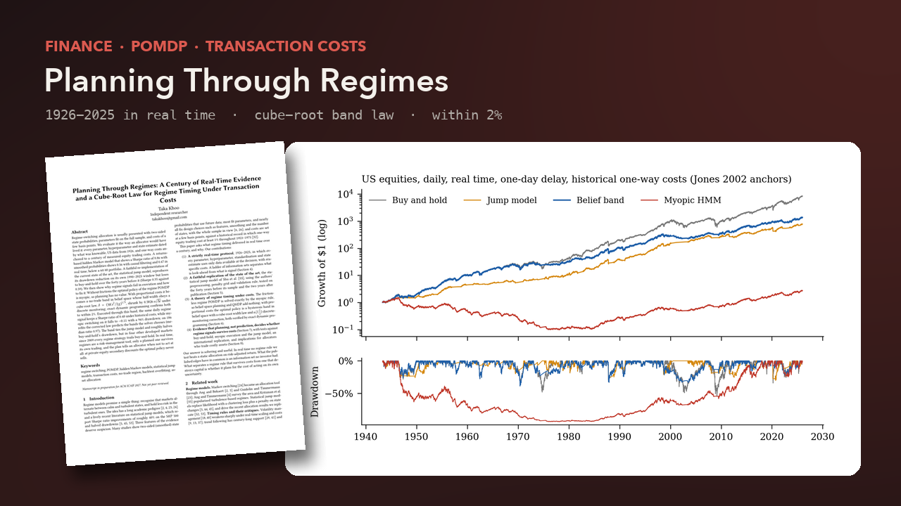</a>
      <b>Planning Through Regimes</b> · <a href="https://takakhoo.com/docs/belief-band-paper.pdf">paper</a> · <a href="https://github.com/takakhoo/belief-band">code</a> · <a href="https://takakhoo.com/regimes">explorer</a> 
      Regime switching tested in strict real time since 1926: the published edges come from look-ahead, and the best recent jump model fails outside its sample. A POMDP with holdings in the state gives a cube-root no-trade band that matches dynamic programming within 2% and survives real trading costs.
        
    </td>
    <td width="50%" valign="top">
      <a href="https://takakhoo.com/docs/transposed-twins-paper.pdf">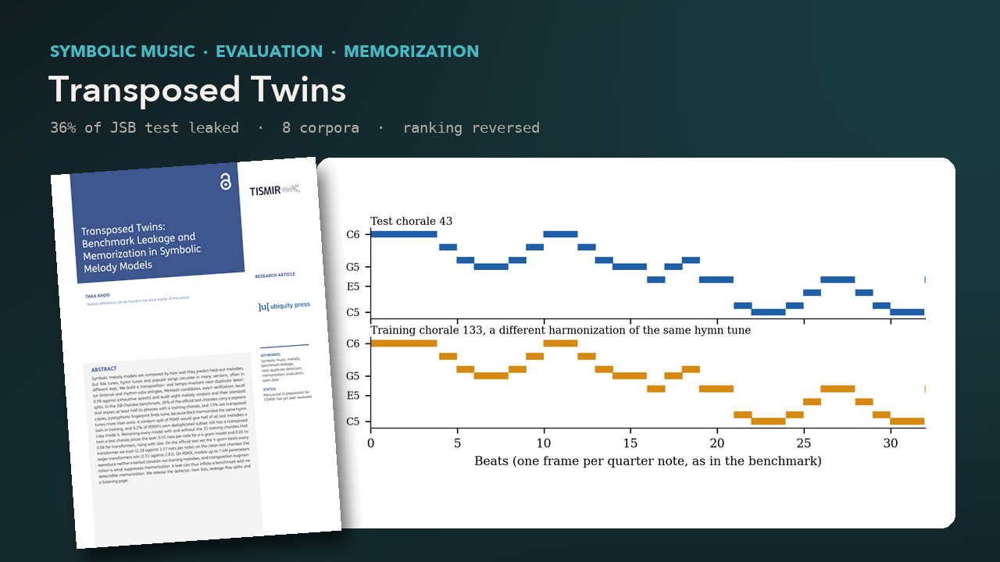</a>
      <b>Transposed Twins</b> · <a href="https://takakhoo.com/docs/transposed-twins-paper.pdf">paper</a> · <a href="https://github.com/takakhoo/transformer-melody-generation">code</a> · <a href="https://takakhoo.com/melodies">listen</a> 
      A transposition-proof twin search over eight melody corpora: 36% of the JSB Chorales test set repeats a training soprano, and half of a random PDMX split would. Retraining without the twins pays a 4-gram 0.55 nats per note against 0.01 to 0.06 for transformers, enough to reverse the ranking.
        
    </td>
  </tr>
  <tr>
    <td width="50%" valign="top">
      <a href="https://takakhoo.com/docs/lacquer-paper.pdf">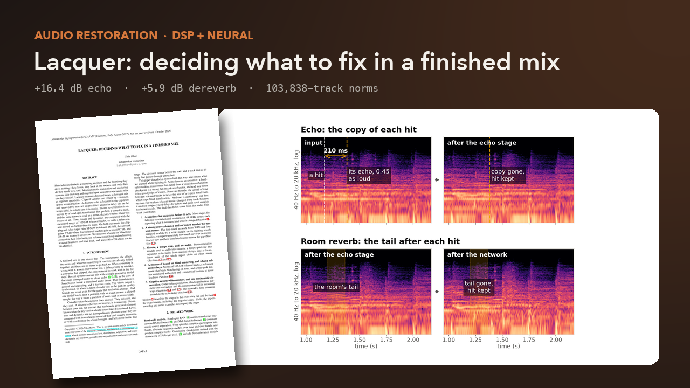</a>
      <b>Lacquer</b> · <a href="https://takakhoo.com/docs/lacquer-paper.pdf">paper</a> · <a href="https://github.com/takakhoo/lacquer">code</a> · <a href="https://takakhoo.com/lacquer">explorer</a> 
      Measure first, then fix. Sparse declipping, cepstral echo removal (+16.4 dB), a band-split transformer for reverb (+5.9 dB where four released models gain at most 0.7 dB), and mastering held to the norms of 103,838 released tracks.
        
    </td>
    <td width="50%" valign="top">
      <a href="https://takakhoo.com/docs/unsplice-paper.pdf">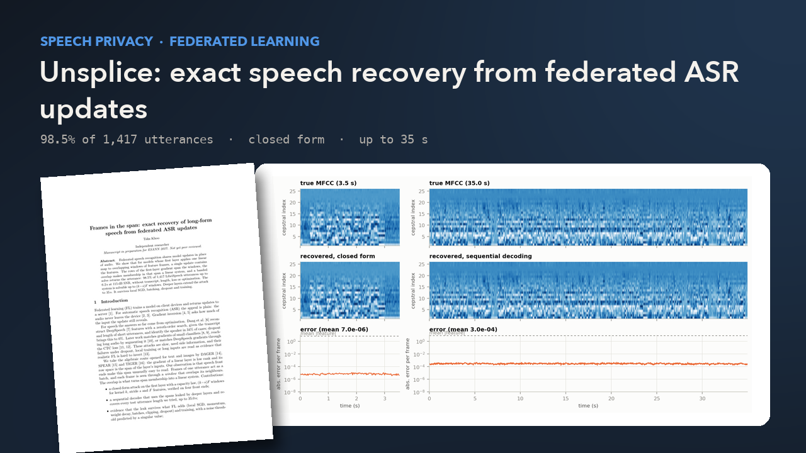</a>
      <b>Unsplice</b> · <a href="https://takakhoo.com/docs/unsplice-paper.pdf">paper</a> · <a href="https://github.com/takakhoo/unsplice">code</a> · <a href="https://takakhoo.github.io/unsplice/">listen</a> 
      One federated update from a speech recognizer gives back the client's audio in closed form: 98.5% of 1,417 LibriSpeech utterances, sequential decoding to 35 s, no transcript and no optimisation. Whisper reads the result at 3.8% WER.
        
    </td>
  </tr>
  <tr>
    <td width="50%" valign="top">
      <a href="https://takakhoo.com/docs/mikiri-paper.pdf">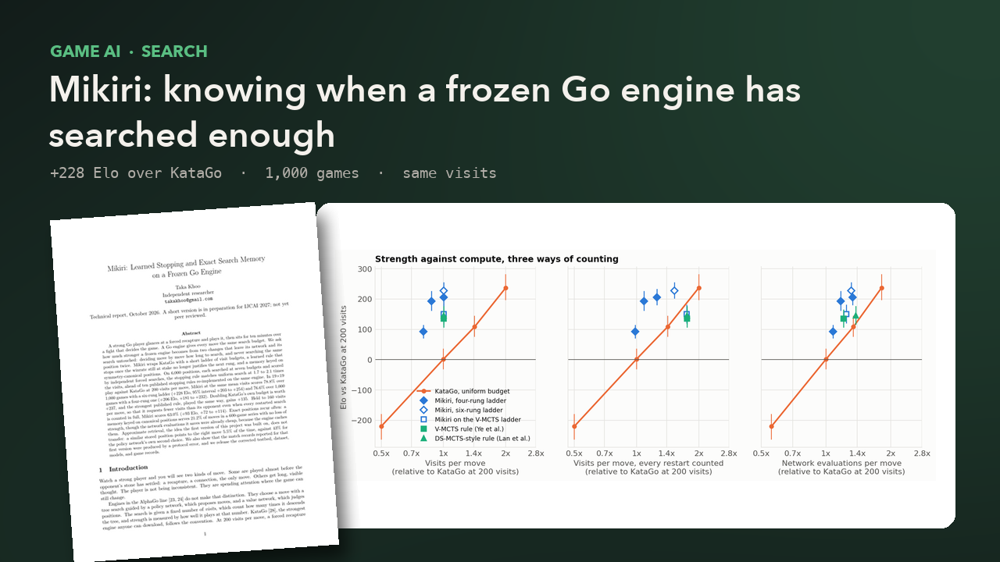</a>
      <b>Mikiri</b> · <a href="https://takakhoo.com/docs/mikiri-paper.pdf">paper</a> · <a href="https://github.com/takakhoo/mikiri-beats-katago">code</a> 
      A learned stopping rule and an exact search memory around a frozen KataGo. At the same mean visits it scores 78.8% over 1,000 games (+228 Elo), ahead of ten published stopping rules re-implemented on the same engine.
        
    </td>
    <td width="50%" valign="top">
      <a href="https://takakhoo.com/docs/audio-sliders-paper.pdf">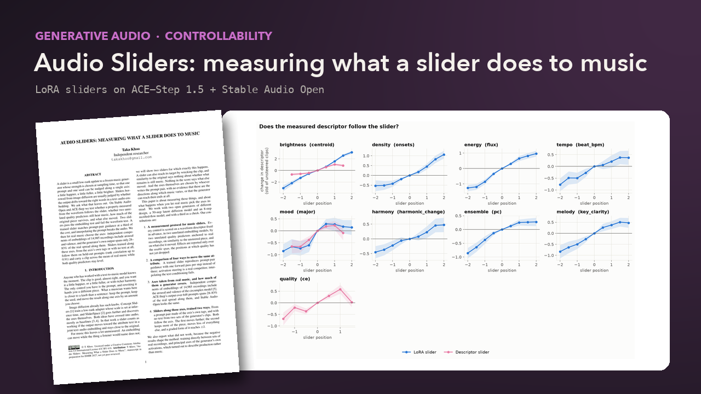</a>
      <b>Audio Sliders</b> · <a href="https://takakhoo.com/docs/audio-sliders-paper.pdf">paper</a> · <a href="https://github.com/takakhoo/audio-diffusion-control">code</a> · <a href="https://takakhoo.github.io/audio-diffusion-control/">live demo</a> · <a href="https://huggingface.co/takakhoo/audio-sliders">weights</a> 
      LoRA sliders on ACE-Step 1.5 and Stable Audio Open, each scored by measured audio descriptors and music-quality models. The newer axes were found in 14,985 real recordings rather than named in advance.
        
    </td>
  </tr>
  <tr>
    <td width="50%" valign="top">
      <a href="https://takakhoo.com/docs/shrinking-edge-paper.pdf">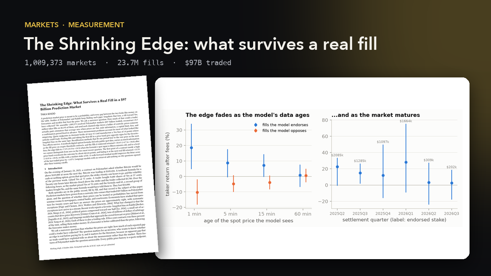</a>
      <b>The Shrinking Edge</b> · <a href="https://takakhoo.com/docs/shrinking-edge-paper.pdf">paper</a> · <a href="https://github.com/takakhoo/prediction-market-research-agent">code</a> 
      1,009,373 resolved Polymarket markets and 23.7 million reconstructed fills, sent down a ladder of controls. Most claimed mispricing is measurement error; two effects survive, and one is fading.
        
    </td>
    <td width="50%" valign="top">
      
      <b>MODULO</b> · <a href="https://modulomusic.com">modulomusic.com</a> · <a href="https://takakhoo.com/docs/modulo-ms-thesis.pdf">thesis</a> · <a href="https://takakhoo.com/docs/modulo-paper.pdf">user study</a> 
      An AI-native music workstation heading to release: native Mac studio in C++ on JUCE and Tracktion, a SwiftUI iOS companion on TestFlight, and a FastAPI + Postgres backend on Render, Supabase, and Cloudflare with Stripe billing and Sign in with Apple.
        
    </td>
  </tr>
</table>

## Watch them run

<table cellspacing="16" cellpadding="8">
  <tr>
    <td width="34%" valign="top">
      <a href="https://github.com/takakhoo/lacquer">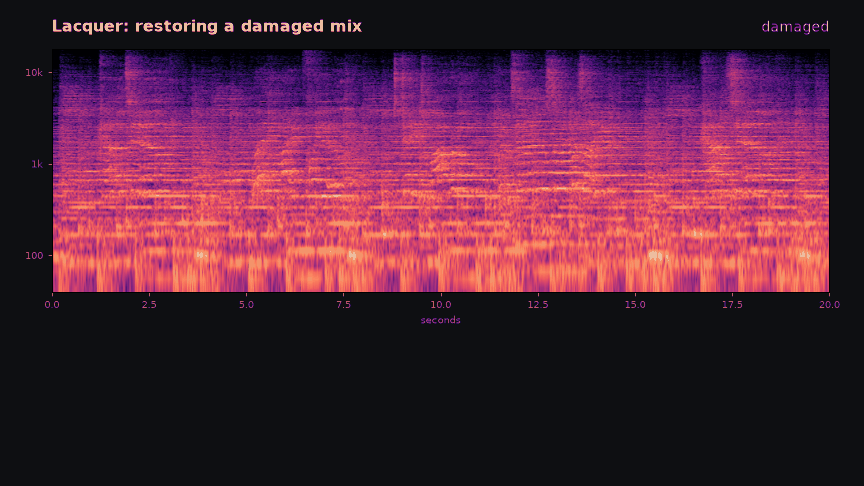</a>
      <b>Lacquer</b> restoring a damaged mix: echo located and removed, reverb measured and left alone when it is music, gain ridden by a learned controller. <a href="https://takakhoo.com/lacquer">Try the decision explorer</a>.
        
    </td>
    <td width="33%" valign="top">
      <a href="https://github.com/takakhoo/mikiri-beats-katago">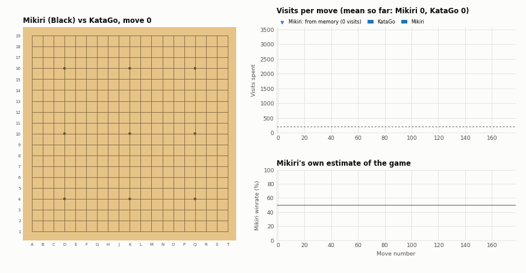</a>
      <b>Mikiri</b> as Black against KataGo: visits per move, memory hits, and its own estimate of the game.
        
    </td>
    <td width="33%" valign="top">
      <a href="https://github.com/takakhoo/prediction-market-research-agent">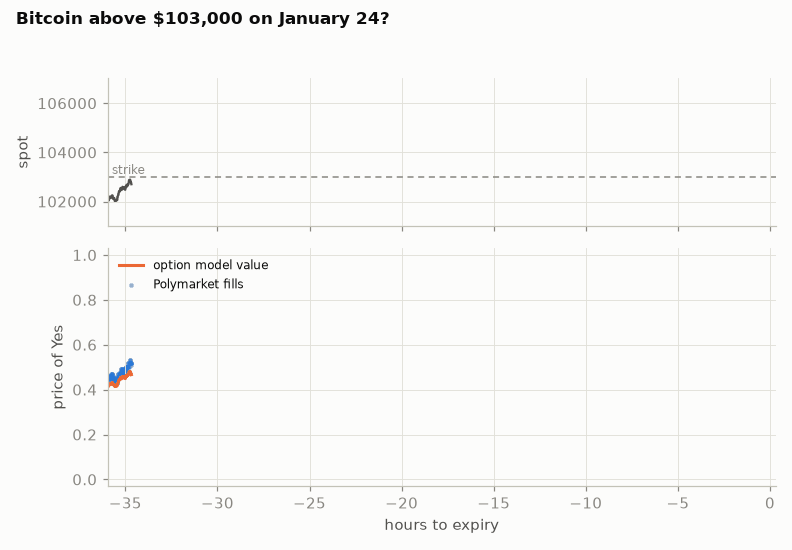</a>
      <b>The Shrinking Edge</b>: a textbook digital-option formula on public spot data tracks Polymarket fills on a Bitcoin threshold contract.
        
    </td>
  </tr>
</table>

Hear the sliders: <a href="https://takakhoo.github.io/audio-diffusion-control/">Audio Sliders demo</a>. Hear the attack: <a href="https://takakhoo.github.io/unsplice/">Unsplice players</a>. Every demo is also playable in the <a href="https://takakhoo.com/library">interactive library on takakhoo.com</a>.

## Engineering focus

`Python` · `C++` · `Swift / SwiftUI` · `TypeScript` · `Objective-C++` · `CMake` · `PyTorch` · `TensorFlow` · `React / Next.js` · `Node.js` · `FastAPI` · `PostgreSQL / Supabase / Neon` · `MongoDB` · `Stripe` · `Cloudflare` · `Docker` · `GCP` · `Render` · `Vercel` · `JUCE` · `Tracktion Engine` · `DSP` · `LaTeX`

Recent work includes native Mac and iOS apps, real-time collaborative products, audio-model evaluation, LLM tool and agent systems, billing and provider backends, and graduate machine-learning instruction.

## Elsewhere

- Portfolio, papers, and music: [takakhoo.com](https://takakhoo.com)
- LinkedIn: [linkedin.com/in/takakhoo](https://www.linkedin.com/in/takakhoo)
- MODULO: [modulomusic.com](https://modulomusic.com)
